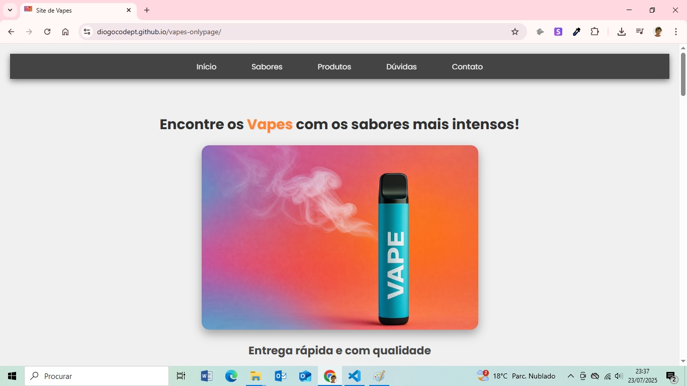
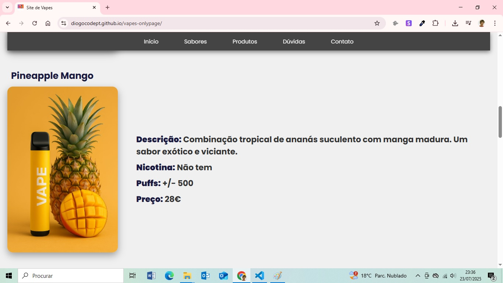

# Vapes – Site de Página Única

Este projeto é um site de página única desenvolvido para divulgar produtos de vape com o objetivo de venda. O layout é responsivo, moderno e otimizado para dispositivos móveis, com foco na simplicidade e navegação fluida.

## 📌 Funcionalidades

- Menu de navegação fixo no topo
- Design totalmente responsivo
- Scroll suave ao clicar nos itens do menu
- Efeitos de hover em botões e elementos visuais
- Secção de contacto com links diretos para:
  - WhatsApp
  - Instagram
  - Facebook

## 🛠 Tecnologias utilizadas

- HTML5
- CSS3
- JavaScript (interações simples e scroll suave)

## 🔗 Link do site online

👉 [https://diogocodept.github.io/vapes-onlypage/]


## 🖼️ Captura de ecrã





## 📁 Estrutura do projeto

```plaintext
/
├── index.html
├── main.css
├── main.js
├── assets/
│   └── imagens, ícones, prints do site, etc.
└── readme.md
